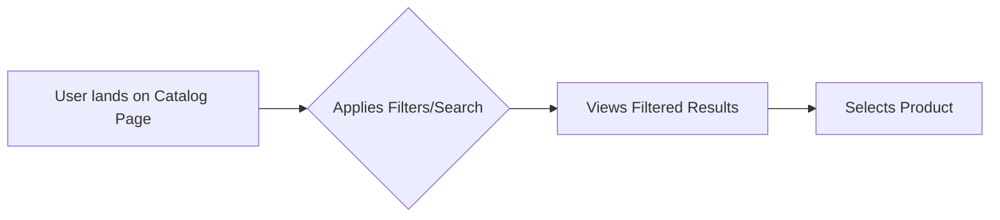
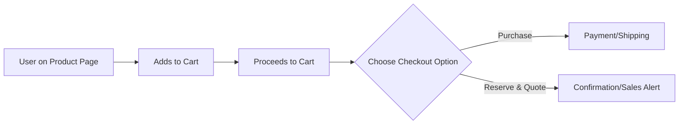
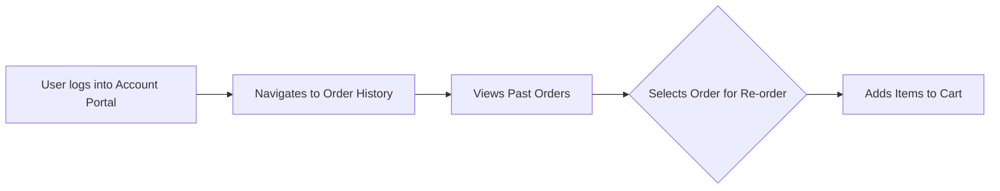

# Product Requirements Document: Karsis B2B e-shop MVP

## Executive Summary

**Product:** Karsis B2B e-shop  
**Version:** MVP (1.0)  
**Document Status:** Draft  
**Last Updated:** pondělí 3. listopadu 2025

### Product Vision
To provide a streamlined, efficient online portal for Karsis's B2B customers, enabling them to quickly order or reserve flooring products, thereby reducing manual processing and enhancing customer satisfaction.

### Success Criteria
- 80% of current B2B customers activated within 3 months.
- Weekly portal orders/reservations surpass email/phone orders.
- 60% monthly retention of activated customers.
- >90% checkout completion rate.

## Problem Statement

### Problem Definition
Karsis's B2B customers currently rely on inefficient methods (email, phone, or consumer e-shop) to order or reserve flooring products. This leads to delays, manual errors, and a cumbersome experience for time-poor B2B buyers who need quick access to product information and ordering capabilities.

### Impact Analysis
- **User Impact:** B2B customers experience frustration and wasted time due to slow ordering processes, lack of immediate product availability information, and the inability to self-serve for common tasks like re-ordering or checking order history.
- **Market Impact:** (Not explicitly defined, but implied by business impact - increased competitiveness through better service)
- **Business Impact:** Karsis faces increased operational costs due to manual order processing, potential loss of business due to customer dissatisfaction with ordering friction, and limited scalability of its B2B sales operations. The portal aims to drive efficiency and speed, ultimately improving the bottom line.

## Target Audience

### Primary Persona: B2B Purchasing Manager / Small Business Owner
**Demographics:**
- Professionals in the flooring/construction trade.

**Psychographics:**
- Time-constrained, practical, values efficiency, prefers direct access to information and self-service.

**Jobs to Be Done:**
1.  Efficiently procure flooring materials for projects.
2.  Quickly re-order frequently purchased items.
3.  Check real-time stock levels for specific products.
4.  Efficiently browse and filter the product catalog by technical attributes.
5.  Request a formal quote or reserve stock for an upcoming job without immediate payment.

**Current Solutions & Pain Points:**
| Current Solution | Pain Points | Our Advantage |
|-----------------|-------------|---------------|
| Email/Phone | Slow, manual, prone to errors, no self-service | Instant access, self-service, reduced errors |
| Consumer E-shop | Not tailored for B2B needs (e.g., bulk ordering, specific pricing, quote requests) | Designed specifically for B2B workflows, dual checkout |

### Secondary Personas
(None explicitly defined)

## User Stories

### Epic: Product Procurement

**Primary User Story:**
"As a purchasing manager, I want to quickly find products using advanced filters and search so that I can efficiently locate the exact flooring materials required for my projects."

**Acceptance Criteria:**
- [ ] User can search by SKU, name, category, and attributes.
- [ ] Search results are displayed quickly and accurately.
- [ ] Filters can be applied and removed easily.

### Supporting User Stories
1. "As a B2B customer, I want to see my specific tiered pricing and real-time stock levels so that I can make informed purchasing decisions."
   - AC: Product listings show current availability.
   - AC: Pricing reflects the general B2B rate (special pricing handled offline).
2. "As a B2B customer, I want to easily re-order past purchases so that I can quickly restock frequently used items."
   - AC: Order history displays past purchases.
   - AC: A "re-order" function is available for past orders.
3. "As a B2B customer, I want the option to either purchase products directly or reserve them and request a quote so that I can manage my procurement based on immediate needs or future project planning."
   - AC: Cart provides clear options for "Purchase" and "Reserve/Quote".
   - AC: "Reserve/Quote" process captures necessary details for sales follow-up.

## Functional Requirements

### Core Features (MVP - P0)

#### Feature 1: B2B Account Management
- **Description:** System for managing B2B customer accounts, including admin-only registration or approval for new sign-ups, and company-level accounts.
- **User Value:** Streamlined access for authorized B2B buyers.
- **Business Value:** Control over who accesses the B2B portal.
- **Acceptance Criteria:**
  - [ ] Admins can approve/deny new B2B registrations.
  - [ ] Multiple users can be associated with a single company account.

#### Feature 2: Product Catalog
- **Description:** Display of flooring products with variations (e.g., color, size), categories, and availability status.
- **User Value:** Comprehensive product information at their fingertips.
- **Business Value:** Centralized product display.
- **Acceptance Criteria:**
  - [ ] Products are categorized and searchable.
  - [ ] Product variations are clearly displayed.
  - [ ] Availability status is shown for each product.

#### Feature 3: Fast Filtering & Search
- **Description:** Robust search functionality by SKU, name, and advanced filtering by category, in-stock status, and key product attributes (e.g., finish, wear_layer).
- **User Value:** Quickly find specific products without browsing extensively.
- **Business Value:** Improved user experience leads to faster conversions.
- **Acceptance Criteria:**
  - [ ] Search returns relevant results for SKU and name.
  - [ ] Filters for category, in-stock, and attributes function correctly.
  - [ ] Filtering is responsive and efficient.

#### Feature 4: Cart & Dual-Path Checkout
- **Description:** Standard shopping cart functionality with clear options to either "Purchase Now" (leading to payment) or "Reserve & Request Quote" (placing a reservation without immediate payment).
- **User Value:** Flexibility in procurement based on immediate needs or quote requirements.
- **Business Value:** Caters to diverse B2B purchasing workflows.
- **Acceptance Criteria:**
  - [ ] Users can add/remove items from the cart.
  - [ ] Clear "Purchase" and "Reserve/Quote" buttons are present in the cart.
  - [ ] "Purchase" flow leads to payment integration.
  - [ ] "Reserve" flow creates a reservation and alerts sales.

#### Feature 5: Customer Account Portal
- **Description:** A dedicated section for B2B customers to view their order and reservation history.
- **User Value:** Self-service access to past transactions.
- **Business Value:** Reduces customer service inquiries.
- **Acceptance Criteria:**
  - [ ] Users can view a list of their past orders.
  - [ ] Users can view a list of their past reservations/quotes.

#### Feature 6: ERP Integration Service
- **Description:** An asynchronous, queue-based service to sync orders (downstream to ERP) and periodically sync inventory/prices (upstream from ERP) via REST API.
- **User Value:** Accurate product availability and order processing.
- **Business Value:** Ensures data consistency between e-shop and ERP, prevents direct ERP calls from blocking checkout.
- **Acceptance Criteria:**
  - [ ] New orders/reservations are successfully queued for ERP sync.
  - [ ] Inventory and price updates are periodically pulled from ERP.
  - [ ] Failed syncs are handled resiliently (retries, DLQ).

### Should Have (P1)
- **Saved Shopping Lists:** Users can create and manage multiple shopping lists for recurring projects or common orders.
- **Quick Re-order Button:** A prominent button within the order history to quickly add all items from a previous order to the current cart.

### Could Have (P2)
- User-level permissions within a company account (e.g., some users can only view, others can order).

### Out of Scope (Won't Have)
- Display of customer-specific pricing tiers in the e-shop (handled offline by sales).
- Real-time (sub-second) inventory updates (periodic sync is sufficient for MVP).
- Marketing blog, loyalty programs, advanced reporting for customers.

## Non-Functional Requirements

### Performance
- **Page Load:** < 2 seconds (p95) for authenticated users.
- **API Response:** < 200ms (p95) for core product catalog and order placement.
- **Filtering/Search:** Near-instant client-side response, or very fast API.

### Security
- **Authentication:** (Implicitly handled by AdonisJS auth)
- **Authorization:** (Implicitly handled by AdonisJS auth)
- **Data Protection:** Adherence to GDPR for data privacy. Data protection in transit and at rest.
- **Compliance:** GDPR.

### Usability
- **Accessibility:** WCAG 2.1 AA minimum.
- **Browser Support:** Latest 2 versions of Chrome, Firefox, Safari, Edge.
- **Mobile Support:** Responsive design for desktop, tablet, and mobile (iOS 14+, Android 10+).

### Scalability
- **User Growth:** Designed to handle growth in B2B customer base and order volume on a single server initially, with architecture allowing for future scaling.
- **Data Growth:** (Implicitly handled by PostgreSQL)

## UI/UX Requirements

### Design Principles
1.  **Efficiency:** Minimize clicks and steps for core tasks (finding products, ordering).
2.  **Information Density:** Utilize tables and data-rich layouts (e.g., Quasar's `QTable`) over large visuals.
3.  **Clarity:** Clear calls to action, intuitive navigation, and unambiguous presentation of product and order information.

### Information Architecture
```
├── Landing Page (Login/Registration)
├── Product Catalog (with Search & Filters)
├── Product Detail Page
├── Shopping Cart
├── Checkout (Purchase / Reserve & Quote)
├── Customer Account Portal
│   ├── Order History
│   ├── Reservation History
│   └── Saved Shopping Lists
└── Settings/Profile
```

### Key User Flows

#### Flow 1: Product Search & Filter


#### Flow 2: Add to Cart & Dual Checkout


#### Flow 3: View Order History & Re-order


## Success Metrics

### North Star Metric
(Not explicitly defined, but implied: Number of B2B orders/reservations processed through the portal)

### OKRs for MVP (First 90 Days)

**Objective 1:** Maximize B2B customer adoption of the portal.
- KR1: 80% of current B2B customers activated (logged in) within 3 months.
- KR2: Weekly portal orders/reservations surpass email/phone orders within 2 months.

**Objective 2:** Ensure a smooth and efficient ordering experience.
- KR1: >90% of users who start a "Purchase" or "Reserve" checkout complete it successfully.
- KR2: 60% of activated customers place at least one order or reservation per month.

### Metrics Framework
| Category | Metric | Target | Measurement |
|----------|--------|--------|-------------|
| Acquisition | Activated B2B Customers | 80% of total | Analytics/DB records |
| Activation | Orders/Reservations via Portal | > Email/Phone | Sales/DB records |
| Retention | Monthly Active Customers | 60% | Analytics/DB records |
| Engagement | Checkout Completion Rate | >90% | Analytics |

## Constraints & Assumptions

### Constraints
- **Budget:** Significant budget constraints for a small Czech company, necessitating cost-effective solutions and efficient development ("vibe coding"). Hosting on a single server.
- **Timeline:** Aggressive MVP launch target of one month.
- **Resources:** Development primarily by a single developer.
- **Technical:** Reliance on AdonisJS v6 and Quasar.js for rapid development.

### Assumptions
- Existing B2B customers are willing to transition to a new online portal.
- Existing customer data can be imported or manually managed for account creation.
- The legacy ERP (Helios Inuvio) can support the required REST API integrations for periodic syncs.

### Dependencies
- Functionality and stability of the legacy ERP system for data exchange.
- Availability of a payment gateway for "Purchase" option.

## Risk Assessment

| Risk | Probability | Impact | Mitigation |
|------|------------|--------|------------|
| ERP Integration Complexity | High | High | Implement asynchronous, queue-based integration (BullMQ); robust error handling with retries and Dead Letter Queue (DLQ). |
| Performance of Advanced Filtering | Medium | Medium | Utilize PostgreSQL's full-text search and optimize database queries; implement client-side filtering where feasible. |
| AdonisJS/Quasar Learning Curve | Medium | Medium | Leverage AI tools (Copilot, Claude) for rapid learning and boilerplate generation; focus on core framework features. |
| Smaller AdonisJS Community | Low | Medium | Rely on comprehensive official documentation; utilize AI for debugging and problem-solving. |
| Customer Adoption Resistance | Medium | High | Clear communication and training for B2B customers; emphasize benefits (speed, efficiency); gather early feedback. |
| Feature Gap in MVP | Low | Medium | Strict adherence to MoSCoW prioritization; continuous feedback loop with early users. |
| Aggressive Timeline (1 month) | High | High | Strict scope management; prioritize only absolute "Must Have" features; leverage AI for accelerated development. |
| Resource Constraints (Solo Dev) | Medium | High | Utilize AI tools extensively; focus on efficient development practices; clear communication with stakeholders on scope. |

## MVP Definition of Done

### Feature Complete
- [ ] All P0 features implemented
- [ ] All acceptance criteria met
- [ ] Code review completed

### Quality Assurance
- [ ] Basic unit test coverage for critical paths
- [ ] Integration tests for ERP sync
- [ ] Manual testing completed for core user flows
- [ ] Performance benchmarks met for key interactions

### Documentation
- [ ] API documentation drafted
- [ ] User documentation drafted for core features
- [ ] Deployment guide created

### Release Ready
- [ ] Staging environment validated
- [ ] Monitoring/alerting configured
- [ ] Rollback plan documented
- [ ] Launch communication prepared

## Appendices

### A. Competitive Analysis
(Summary from research: B2B buyers are time-poor, know what they need, and often re-order the same items. Existing solutions are email/phone or generic consumer e-shops.)

### B. Technical Specifications
(Link to Technical Design Document - Part III)

### C. Mockups/Wireframes
(Links or embedded images - to be created)

---
*PRD Version: 1.0*  
*Next Review: [Date]*  
*Owner: [Name]*  
*Stakeholders: [List]*